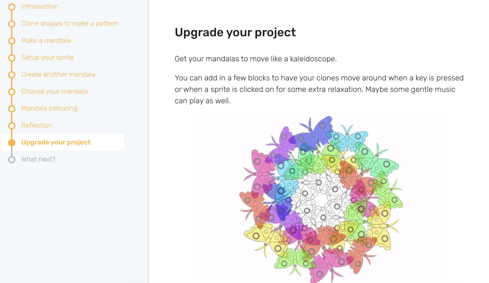

## Learning resources

Dojos are hardware and software agnostic. That means that young people and volunteers can use whatever resources, tools, and programming languages suit their needs. There are lots of freely available resources online, from unplugged activities to hardware emulators to tools to help young people develop computational thinking.  
  
## Icebreakers and unplugged activities
Icebreaker activities are designed to welcome and encourage interaction among Ninjas at the start of a Dojo. Offline or unplugged activities take place away from a computer and model key concepts (e.g. selection, variables, algorithms) in different ways. These short games are fantastic ways to help new Ninjas feel relaxed, and can also help young people learn coding concepts and terminology in a fun, informal way.

--- task ---
Check out some example [icebreaker and unplugged activities](https://coderdojo.com/2022/08/24/icebreakers-and-unplugged-activities-for-your-club/){:target="_blank"}.
  
--- /task ---
  

## Our project resources
One way we support clubs is by offering learners a catalogue of [more than 250 free digital making projects](https://projects.raspberrypi.org/en){:target="_blank"}! Some of them have been translated into 30 languages.
  
--- task ---
Familiarise yourself with the projects young people are working on so you are better able to support them. 
--- /task ---

### [Improved project paths](https://projects.raspberrypi.org/en/paths){:target="_blank"}

Recently, we’ve released our educational projects in a new format to better support young people who want to learn coding and gradually develop independence. 

--- collapse ---
---
title: New path structure
---

Each path is made up of six projects, of three different types, in a 3-2-1 structure:

+ The first **three Explore projects** introduce learners to a set of skills and knowledge, and provide step-by-step instructions to help learners develop initial confidence. 
+ The next **two Design projects** are opportunities for learners to practise the skills they learnt in the previous Explore projects, and to express themselves creatively. 
+ In the final **one Invent project**, learners focus on completing a project to meet a project brief for a particular audience. The project brief is written so that they can meet it using the skills they’ve learnt by following the path up to this point. 
  

--- /collapse ---

### New project features

We’ve also introduced some new features to add interactivity, choice, and authenticity to each project in a path:

--- collapse ---
---
title: Real-world info box-outs
---

Provide interesting and relevant facts about the skills and knowledge being taught.
  

--- /collapse ---

--- collapse ---
---
title: Design decision points
---
Allow learners to make choices about how their project looks and what it does, based on their preferences and interests.
  

--- /collapse ---

--- collapse ---
---

title: Debugging tips

---
Throughout each project, debugging tips give learners guidance for finding and fixing common coding mistakes.

--- /collapse ---
  
--- collapse ---
---
title: Project reflection steps
---
Solidify new knowledge and provide opportunities for mastery by letting learners revisit the important learnings from the project. Common misconceptions are highlighted, and learners are guided to the correct answer.

--- /collapse ---

--- collapse ---
---
title: An open-ended upgrade step
---
The end of each project offers inspiration for young people, by giving them ideas for ways in which they could continue to improve upon their project in the future.

--- /collapse ---
 

You can learn more about our new paths and their features with [our facilitator guide](https://projects.raspberrypi.org/en/projects/321-make-facilitator-guide){:target="_blank"}.

--- save ---
